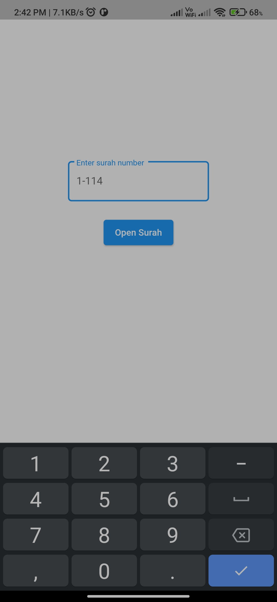
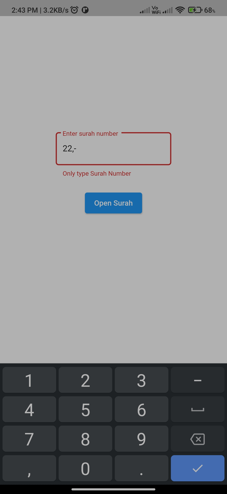
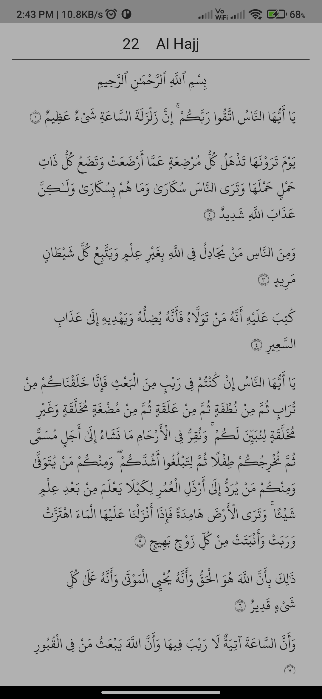

# quran_app

A new Flutter project.

## Familiarizing with flutter so:
A simple quran app, You can increase the fontsize with double Tap and decrease with long press

## Credits
[Quran flutter package](https://pub.dev/packages/quran) by [aqeelshamz](https://github.com/aqeelshamz/quran)

### example 

